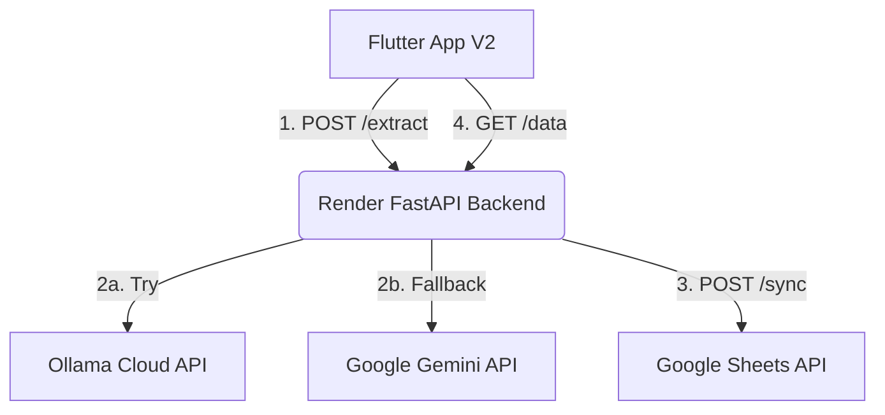

# 🎴 Visiting Card Extractor - Version 2 (Cloud Edition)

Welcome to **Version 2** of the Cloud-Optimized Visiting Card Extractor! This version completely decouples extraction from local hardware, migrating to a high-availability cloud backend hosted on **Render.com**. It supports **official Ollama Cloud APIs**, a highly robust **Google Gemini 1.5 Flash automated fallback**, a fully loaded **Sheet Data Viewer** with advanced search, sorting, and filters, and a powerful **multi-image Batch Processing pipeline**.

---

## 🌟 System Architecture

1. **Flutter Mobile App (V2)**: Captures or picks cards, triggers automated batch uploads, displays a live Google Sheet database, and manages custom hosts/ports.
2. **FastAPI Backend (V2)**: Dynamically hosted on Render, handles cross-origin (CORS) mobile requests, and manages the AI orchestration and sheet synchronization.
3. **Primary AI (Ollama Cloud)**: Connects to the official hosted Ollama servers using your unique API key.
4. **Backup AI (Gemini 1.5 Flash)**: Acts as a silent enterprise fail-safe. If Ollama fails, rate limits, or expires, the backend automatically extracts your data using Gemini.
5. **Database (Google Sheets)**: Houses all scanned contacts, automatically preventing duplicates and indexing entries.

---

## 🛠️ Backend Deployment (Render)

The backend is configured to be 100% plug-and-play with Render using the custom `render.yaml` configuration.

### 1. Set Up Secret Files
Because you should never commit your Google Credentials to GitHub, Render manages them via **Secret Files**:
* During deployment, create a Secret File named `credentials.json`.
* Copy the contents of your local Google Service Account `credentials.json` and paste them into the box.
* The backend will automatically detect this file in `/etc/secrets/credentials.json` and authenticate.

### 2. Required Environment Variables
Configure the following in the **Environment Variables** tab of your Render service:

| Variable Name | Description | Example Value |
| :--- | :--- | :--- |
| `OLLAMA_BASE_URL` | The endpoint for your Ollama instance | `https://ollama.com` |
| `OLLAMA_API_KEY` | Your official Ollama API Key | `ollama_sec_xxxx` |
| `GEMINI_API_KEY` | Your Google Gemini API Key (Backup) | `AIzaSyA...` |
| `GOOGLE_SHEET_ID` | The ID of your target Google Sheet | `1sOYLSNJ9EFkpX2mc...` |
| `PYTHON_VERSION` | Forces Python compatibility | `3.10.0` |

---

## 📱 Mobile App Setup & Config

Open the **`mobile_app_v2`** project in Flutter and launch it on your device/emulator.

### 1. Connecting to the Cloud Backend
1. Tap the **Settings (Gear)** icon at the top right of the Home screen.
2. **Server Host**: Enter your Render Web Service URL **without the `https://` prefix** (e.g. `visiting-card-extractor.onrender.com`).
3. **Server Port**: Change this to exactly **`443`** (Render routes secure traffic over port 443).
4. Save the settings.

---

## 📖 Complete Usage Guide

### 1. Manual Single Card Extraction
* Tap **Scan New Card** on the Home screen.
* Capture a card using your camera or choose **1 image** from the gallery.
* The app will extract the data and show you the `ResultScreen`.
* Review or edit any fields, then tap **Sync & Close**. If the card is already in your Google Sheet, the app will gracefully show an orange SnackBar warning you of the duplicate and prevent double-uploading!

### 2. Multi-Select Batch Sync (Gallery)
* Tap **Scan New Card** and select **Choose from Gallery**.
* Long-press to select **multiple images** at once.
* The app automatically launches the **Batch Processing Screen**:
  * It will display a progress tracker showing exactly which card is being processed (e.g., `Processing 2 of 5`).
  * It extracts data, checks duplicates, and syncs directly to the Google Sheet without requiring manual confirmation for every single card.
  * Once finished, a complete **Summary List** displays exactly which cards were uploaded successfully (Green check) and which ones were skipped as duplicates or failed (Orange/Red warning).

### 3. Sheet Data Viewer (Filters & Sorting)
Tap the **Sheet Data** tab on your Bottom Navigation Bar to browse your live database:
* **Search Bar**: Type any text to instantly filter cards by Point Person, Organization, Email, or Phone.
* **Channel Filter**: Quick-filter your cards by Organization Type (e.g., *UNIVERSITY, BUSINESS, NGO*).
* **Sorting Dropdown**: 
  * **Newest First** (Default): Keeps your most recent uploads right at the top.
  * **Oldest First**: Displays cards in ascending order.
  * **A-Z (Person)**: Sorts alphabetically by name.
  * **A-Z (Organization)**: Sorts alphabetically by company/university.
* **Row Numbers**: Every card displays its exact Google Sheet Row Number (e.g. `#42`) in the top-right corner.
* **Pull-to-Refresh**: Simply swipe down from the top to refresh and pull the latest records from the cloud.

---

## 🛑 Troubleshooting

### App is hanging or timing out
1. **Check the Port**: Ensure your **Server Port** in the mobile app settings is set to **`443`**. If it is set to `8000` or `8001`, the connection will hang because Render only exposes port 443 publicly.
2. **Render Spin-Up Delay**: If the server has been inactive for 15 minutes, Render spins it down. The very first request you make will take **~50 seconds** to wake up the server. Subsequent requests will be instant!
3. **Verify Render Logs**: Open your Render Web Service dashboard to check the logs. Our new traceback logger will print any internal sheet or AI errors immediately.
